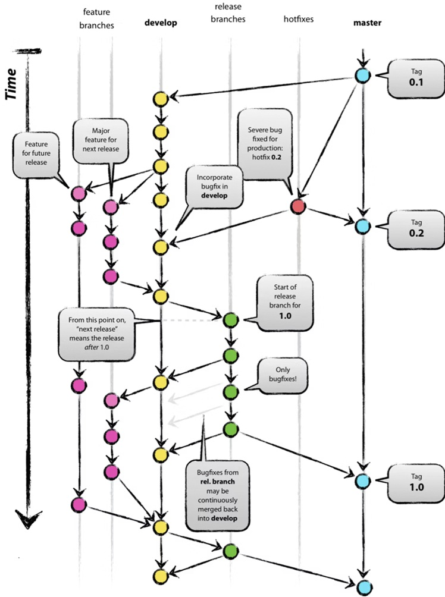

# workez-server

ETM2025で作成する椎茸自動仕分けシステムのプロトタイプ開発管理のためのリポジトリ．

---

- [workez-server](#workez-server)
- [システム構成](#システム構成)
- [ドキュメント](#ドキュメント)
- [Commit Message Guidelines](#commit-message-guidelines)
- [ブランチ管理](#ブランチ管理)
- [使い方](#使い方)
  - [1. 開発環境](#1-開発環境)
  - [1.1 環境変数の設定](#11-環境変数の設定)
  - [1.2 コンテナの作成](#12-コンテナの作成)
  - [1.3 実行確認](#13-実行確認)
  - [2. 本番環境](#2-本番環境)


# システム構成

システム構成を示す．

| 項目             | 技術 / ソフトウェア | バージョン |
|------------------|---------------------|------------|
| OS               | Ubuntu              | 24.04 LTS  |
| コンテナ         | Docker              | TBD       |
| VPN              | TBD                 | TBD         |
| フロントエンド   | React.js            | TBD       |
| バックエンド     | Django              | TBD       |
| データベース     | SQLite3             | TBD          |
| リバースプロキシ | nginx               | TBD       |
| IoT通信プロトコル          | mqtt-broker         | TBD       |
| IoTデバイス      | Raspberry Pi        | 5          |
| Raspberry Pi OS  | Ubuntu              | 24.04 LTS  |

# ドキュメント

- API仕様: `docs/api/openapi.yaml`
- 認証・認可: `docs/auth/auth_design.md`
- DB定義: `docs/db/schema.md`
- テスト: `docs/test/test_strategy.md`


# Commit Message Guidelines

コミットガイドラインに従いコミットすること．

| **Type**     | **Description**                                                                 |
|--------------|---------------------------------------------------------------------------------|
| feat         | 新機能の追加                                                                   |
| fix          | バグの修正                                                                      |
| docs         | ドキュメントのみの変更                                                      |
| style        | スペースやインデントなどコードの見た目の変更 |
| refactor     | リファクタリング                      |
| perf         | 機能のパフォーマンス向上（遅延時間を短縮など）                                     |
| test         | テストの追加，変更                                     |


# ブランチ管理

ブランチによって開発工程を管理し，バージョン管理を行う．



# 使い方

## 1. 開発環境

## 1.1 環境変数の設定

コマンドを実行し`.env.local`と`.env.production`を作成する．

```shell
chmod +x ./generate_env.sh
./generate_env.sh          # 環境変数を作成

./generate_env.sh --force  # 上書き作成する場合
```

## 1.2 コンテナの作成

dockerコンテナを起動する．

```shell
docker compose --env-file .env.local -f docker-compose.yml -f docker-compose.local.yml up -d --build
```

npmサーバーを起動する．

```shell
npm start
```

JWTトークンを取得する．

```shell
docker compose --env-file .env.local -f docker-compose.yml -f docker-compose.local.yml exec -T api python tools/issue_jwt.py --role user --sub user_001
```

## 1.3 実行確認

ホストPCから収穫登録するときはJWTトークンを使って以下のURLでアクセスする．

`http://localhost:3000/harvest_register.html?jwt={JWTトークン}`

ホストPCから収穫一覧（タブレット）を確認するときは以下のURLでアクセスする．

`http://localhost:3000/harvest_list.html?jwt={JWTトークン}`

データベースに保存されたことを確認する（最新20件の収穫レコードを表示）．

```shell
docker compose --env-file .env.local -f docker-compose.yml -f docker-compose.local.yml exec -T db sh -lc 'psql -U "$POSTGRES_USER" -d "$POSTGRES_DB" -c "SELECT created_at, occurred_at, lot_name, size_id, rank_id, count, event_id FROM harvest_records ORDER BY created_at DESC LIMIT 20;"'
```

## 2. 本番環境


TBD
