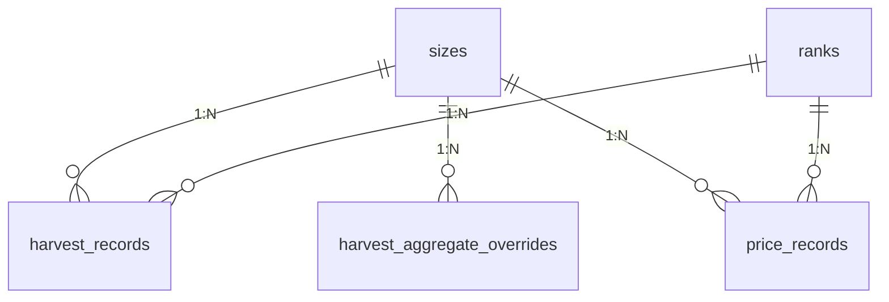

# データベース定義

## 1. スコープ
- 本資料は Django アプリが管理する業務テーブルを対象とする（`auth_*`, `django_*` などの Django 標準テーブルは省略）。
- 本資料は以下の変更を反映する：
  - `harvest_records` から `category_id` / `category_name` を削除し、`size_id` / `rank_id` / `lot_name` を追加
  - `harvest_records.count` を小数（0.1刻み）に対応するため `decimal(10,1)` 相当に変更
  - `harvest_records` の日時は `harvested_at` のみに統一（`occurred_at` を削除、`created_at` を `harvested_at` にリネーム）
  - `harvest_aggregate_overrides` の `category_id` / `category_name` を `size_id` / `size_name` に変更
  - `defects_records` から `category_id` / `occurred_at` を削除し、`count` を `decimal(10,1)` 相当に変更
  - `price_records` から `category_id` / `category_name` を削除し、`size_id` / `rank_id` / `year` / `month` を追加
  - `sizes` / `ranks` テーブルを追加（初期レコードあり）

## 2. DBエンジン（環境差分）
- 開発（デフォルト）：SQLite3（`api/db.sqlite3`）
- `DATABASE_URL` が設定されている場合：その設定に従う（例：PostgreSQL）

補足：
- `USE_TZ=True` のため、`DateTimeField` はタイムゾーン付きとして扱う（DBへの保存形式はエンジンに依存）。

## 3. リレーション（物理FKのみ）

## 4. テーブル定義

### `users`（`apps.users.User`）
| カラム | 型（概念） | NULL | 制約/補足 |
|---|---|---:|---|
| `id` | uuid | NO | PK |
| `email` | varchar(254) | NO | UNIQUE |
| `name` | varchar(255) | NO |  |
| `role` | varchar(20) | NO | default=`user`（`admin`/`user`） |
| `created_at` | datetime | NO | 自動設定（作成時） |
| `updated_at` | datetime | NO | 自動更新 |

### `harvest_records`（`apps.harvest.HarvestRecord`）
| カラム | 型（概念） | NULL | 制約/補足 |
|---|---|---:|---|
| `id` | uuid | NO | PK |
| `event_id` | uuid | YES | UNIQUE（冪等キー用途） |
| `lot_name` | varchar(64) | NO |  |
| `size_id` | varchar(64) | NO | FK → `sizes.size_id` |
| `rank_id` | varchar(64) | NO | FK → `ranks.rank_id` |
| `count` | decimal(10,1) | NO | 収穫量（0.1刻み） |
| `harvested_at` | datetime | NO | 収穫日時 |

### `harvest_aggregate_overrides`（`apps.harvest.HarvestAggregateOverride`）
| カラム | 型（概念） | NULL | 制約/補足 |
|---|---|---:|---|
| `id` | uuid | NO | PK |
| `period_type` | varchar(16) | NO | `daily`/`weekly`/`monthly` |
| `period` | varchar(16) | NO | `YYYY-MM-DD` / `YYYY-Www` / `YYYY-MM` |
| `size_id` | varchar(64) | NO | FK → `sizes.size_id` |
| `size_name` | varchar(255) | YES |  |
| `total_count` | int | NO |  |
| `updated_at` | datetime | NO | 自動更新 |

制約：
- UNIQUE（`period_type`, `period`, `size_id`）

### `harvest_targets`（`apps.harvest.HarvestTarget`）
| カラム | 型（概念） | NULL | 制約/補足 |
|---|---|---:|---|
| `id` | uuid | NO | PK |
| `target_type` | varchar(16) | NO | UNIQUE（`daily`/`weekly`/`monthly`） |
| `target_count` | int | NO |  |
| `updated_at` | datetime | NO | 自動更新 |

### `defects_records`（`apps.defects.DefectsRecord`）
| カラム | 型（概念） | NULL | 制約/補足 |
|---|---|---:|---|
| `id` | uuid | NO | PK |
| `event_id` | uuid | YES | UNIQUE（冪等キー用途） |
| `count` | decimal(10,1) | NO | 不良品数（0.1刻み） |
| `created_at` | datetime | NO | 自動設定（作成時） |

### `price_records`（`apps.prices.PriceRecord`）
| カラム | 型（概念） | NULL | 制約/補足 |
|---|---|---:|---|
| `id` | uuid | NO | PK |
| `size_id` | varchar(64) | NO | FK → `sizes.size_id` |
| `rank_id` | varchar(64) | NO | FK → `ranks.rank_id` |
| `unit_price_yen` | int | NO |  |
| `year` | int | NO |  |
| `month` | int | NO |  |
| `updated_at` | datetime | NO | 自動更新 |

制約：
- UNIQUE（`size_id`, `rank_id`, `year`, `month`）

### `sizes`（マスタ：サイズ）
| カラム | 型（概念） | NULL | 制約/補足 |
|---|---|---:|---|
| `size_id` | varchar(64) | NO | PK |
| `size_name` | varchar(255) | NO |  |

初期レコード：
- `L`, `M`, `S`, `SS`, `3S`, `小`（= 極小）, `黒`

### `ranks`（マスタ：ランク）
| カラム | 型（概念） | NULL | 制約/補足 |
|---|---|---:|---|
| `rank_id` | varchar(64) | NO | PK |
| `rank_name` | varchar(255) | NO |  |

初期レコード：
- `A`, `B`, `C`, `小`, `廃棄`
